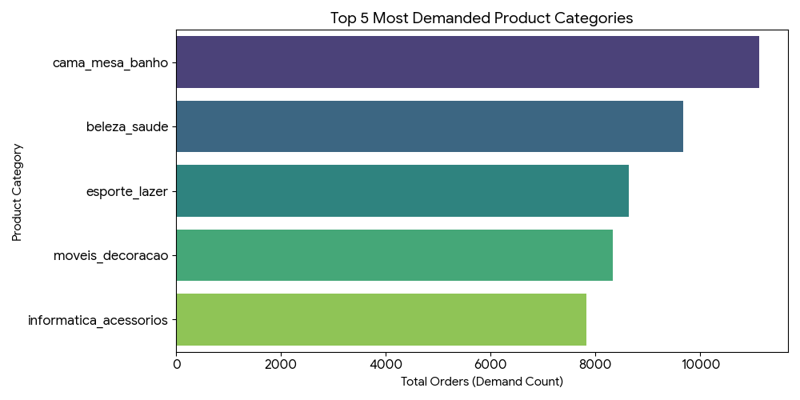
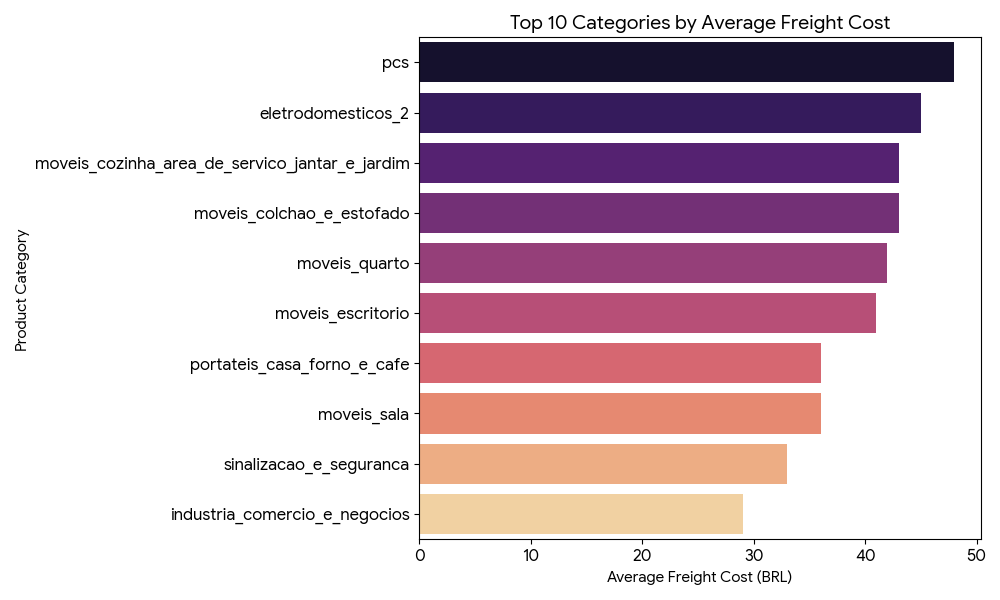
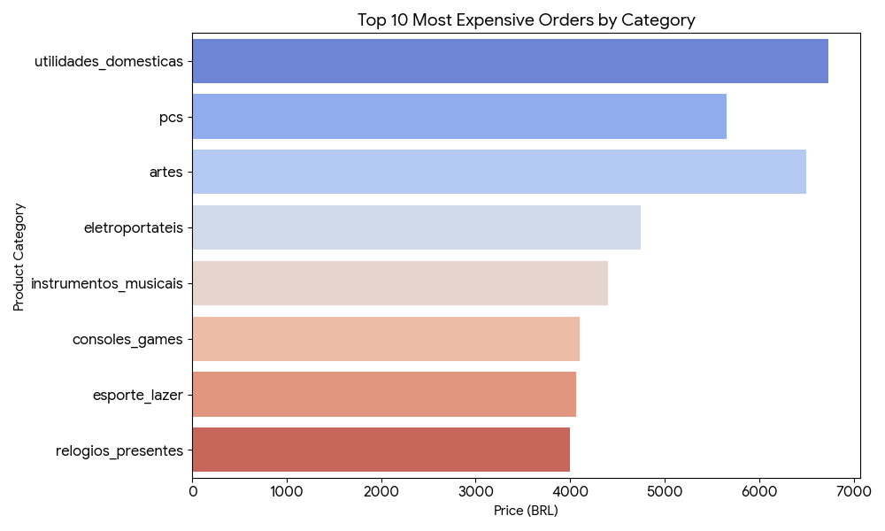

# 🛒 Brazilian E-Commerce Analysis with SQL


---

## 📖 Introduction

This project explores the **Brazilian E-Commerce Public Dataset by Olist** using SQL to uncover insights into customer demand, product pricing, and freight costs across different product categories.

By analyzing real-world e-commerce transactions, this project answers three key business questions:

* Which product categories have the highest demand?
* Which categories contain the most expensive order items?
* Which categories have the highest average freight costs?

The analysis demonstrates how SQL can be used to extract meaningful business insights from large-scale e-commerce data and how AI-generated visualizations can help communicate those insights effectively.

---

## 📂 Dataset

This project uses the **Brazilian E-Commerce Public Dataset by Olist** from Kaggle:

🔗 https://www.kaggle.com/datasets/olistbr/brazilian-ecommerce

The dataset contains information related to:

* 📦 Orders
* 🛍️ Products
* 🏪 Sellers
* 👥 Customers
* 💳 Payments
* ⭐ Reviews
* 🚚 Freight Costs

---

## 🛠️ Tools Used

| Tool          | Purpose                                          |
| ------------- | ------------------------------------------------ |
| 🐘 PostgreSQL | Data querying and analysis                       |
| 📊 Excel      | Reviewing exported query results                 |
| 🤖 Gemini AI  | Generating visualizations from SQL query outputs |
| 🌿 Git        | Version control                                  |
| 🐙 GitHub     | Project hosting and documentation                |

---

# 🔍 Analysis

## 1️⃣ Top 5 Most Demanded Product Categories

Understanding which categories receive the highest number of orders helps identify customer purchasing trends.

### SQL Query

```sql
SELECT 
    products.product_category_name,
    COUNT(order_items.order_id) AS demand_count
FROM order_items
INNER JOIN products
    ON order_items.product_id = products.product_id
GROUP BY products.product_category_name
ORDER BY demand_count DESC
LIMIT 5;
```

### 📈 Visualization



### 💡 Key Findings

* 🛏️ **cama_mesa_banho (Bed, Bath & Table)** is the most demanded category.
* 💄 **beleza_saude (Health & Beauty)** ranks second in total orders.
* ⚽ **esporte_lazer (Sports & Leisure)** shows strong customer demand.
* 🏠 **moveis_decoracao (Furniture & Decoration)** remains a popular category.
* 💻 **informatica_acessorios (Computer Accessories)** rounds out the top five.

### 📊 Business Insight

Demand is heavily concentrated in everyday household and lifestyle products, indicating strong and consistent consumer purchasing behavior in these categories.

---

## 2️⃣ Categories with the Highest Average Freight Cost

Freight costs directly impact logistics expenses and operational efficiency.

### SQL Query

```sql
SELECT 
    products.product_category_name,
    ROUND(AVG(order_items.freight_value), 0) AS avg_freight
FROM order_items
INNER JOIN products
    ON order_items.product_id = products.product_id
GROUP BY products.product_category_name
ORDER BY avg_freight DESC
LIMIT 10;
```

### 📈 Visualization



### 💡 Key Findings

* 💻 **pcs (Computers)** has the highest average freight cost.
* 🔌 Appliance-related categories appear among the most expensive to ship.
* 🪑 Multiple furniture categories rank within the top freight-cost categories.
* 🚚 Average freight costs for several categories exceed 40 BRL.

### 📊 Business Insight

Products that are larger, heavier, or more difficult to transport generally incur higher logistics costs.

---

## 3️⃣ Top 10 Most Expensive Order Items

This analysis identifies the highest-priced order items in the dataset.

### SQL Query

```sql
SELECT
    order_items.order_id,
    products.product_category_name,
    order_items.price,
    order_items.freight_value,
    order_items.seller_id
FROM order_items
LEFT JOIN products
    ON order_items.product_id = products.product_id
ORDER BY order_items.price DESC
LIMIT 10;
```

### 📈 Visualization



### 💡 Key Findings

* 🏠 **utilidades_domesticas (Housewares)** contains the highest-priced order item.
* 💻 **pcs (Computers)** appears multiple times among the top-priced order items.
* 🎨 **artes (Arts)** also contributes several high-value products.
* 💰 The most expensive order items range from approximately **4,000 BRL to nearly 7,000 BRL**.

### 📊 Business Insight

High-value purchases are concentrated within a small number of product categories, particularly Housewares, Computers, and Arts.

---

# 📚 What I Learned

Throughout this project, I strengthened my ability to:

* 🔗 Combine tables using **INNER JOIN** and **LEFT JOIN**
* 📊 Aggregate data using **COUNT()** and **AVG()**
* 🏆 Rank results using **ORDER BY** and **LIMIT**
* 🧹 Extract meaningful insights from raw transactional data
* 📈 Interpret SQL results through visualizations generated with AI tools
* 🛒 Analyze e-commerce demand and logistics-related metrics

---

# 🎯 Conclusion

This analysis highlights important patterns within Brazil's e-commerce marketplace.

### Key Takeaways

✅ **Bed, Bath & Table** is the most demanded product category.

✅ **Computers** have the highest average freight costs.

✅ **Housewares, Computers, and Arts** contain some of the highest-priced order items.

✅ Customer demand, product pricing, and logistics costs vary significantly across categories.

By leveraging SQL and data visualization techniques, this project demonstrates how operational and commercial insights can be extracted from large-scale e-commerce datasets.

---

## 👨‍💻 Author

**Mahir Dhiyan Chowdhury**

💼 Aspiring Data Analyst | Operations & Supply Chain Enthusiast | Engineer

🔗 GitHub: https://github.com/mahir-dhiyan

---

⭐ If you found this project interesting, consider giving it a star!
